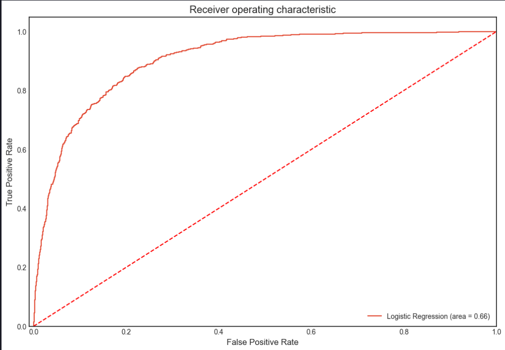

# Bank marketing campaigns dataset | Opening Deposit

## Domain Proyek

ini adalah dataset yang mendeskripsikan hasil dari portugal bank marketing campaign

Ini adalah kumpulan data yang menggambarkan hasil kampanye pemasaran bank di Portugal. Kampanye yang dilakukan sebagian besar berbasis panggilan telepon langsung, menawarkan kepada klien bank untuk menempatkan deposito berjangka. Jika setelah semua upaya pemasaran klien setuju untuk menempatkan deposito, variabel target ditandai dengan 'yes', jika tidak maka 'no'.

Sumber data:

[Link Dataset UCI](https://archive.ics.uci.edu/ml/datasets/bank+marketing)

Ada penurunan pendapatan di bank Portugal dan mereka ingin mengetahui tindakan apa yang harus diambil. Setelah penyelidikan, ditemukan bahwa penyebab utamanya adalah karena klien mereka tidak melakukan deposito sesering sebelumnya. Mengetahui bahwa deposito berjangka memungkinkan bank untuk menahan dana untuk jangka waktu tertentu, sehingga bank dapat menginvestasikan dana tersebut dalam produk keuangan dengan keuntungan lebih tinggi untuk menghasilkan keuntungan. Selain itu, bank juga memiliki peluang lebih besar untuk membujuk klien deposito berjangka untuk membeli produk lain seperti reksa dana atau asuransi guna meningkatkan pendapatan mereka lebih lanjut. Akibatnya, bank Portugal ingin mengidentifikasi klien yang memiliki peluang lebih tinggi untuk berlangganan deposito berjangka dan fokus upaya pemasaran pada klien tersebut.

**WHY IS IT IMPORTANT USING MACHINE LEARNING**

masalah ini bisa diselesaikan machine learning karena dengan machine learning model bisa untuk menyortir beberapa atribut dengan tipe numerical data (dalam kasus ini yaitu nasabah yang melakukan deposit jangka panjang) yang di inginkan sehingga perlu adanya klasifikasi pada permasalahan ini

## Businees Understanding

dengan latar belakang di atas problem statement yang bisa di definisikan adalah

### Problem Statement

- Identifikasi klien yang memiliki peluang lebih tinggi untuk berlangganan depostio berjangaka panjang agar bisa fokus upaya pemasaran pada klien tersebut

### Goals

- agar Bank bisa fokus pada klien yang berdeposit berjangka panjang agar tidak mengalami pendapatan minim

### Solution Stataments

Salah satu metode yang dapat menjawab goals di atas adalah dengan membuat model logical regression degan memprediksi apakah ada deposito yang dilakukan berdasarkan nilai-nilai dari fitur-fitur tersebut. Hasilnya akan berupa 0 atau 1. Jadi,saya dapat memutuskan untuk menggunakan model klasifikasi untuk masalah ini.

## Data Understanding

**Dataset:**

Data yang disediakan memiliki 4118 instance dan 21 fitur. Informasinya mengatakan tidak ada nilai nol. Bagaimanapun, perlu dilakukan pengawasan ketat di setiap fitur dan memeriksa catatan yang mencurigakan serta memanipulasinya.

**Atribut:**
**Data klien bank:**

1. **Age**: Usia prospek (numerik)
2. **Job**: Jenis pekerjaan (Kategorikal)
3. **Marital**: Status pernikahan (Kategorikal)
4. **Education**: Kualifikasi pendidikan prospek (Kategorikal)
5. **Default**: Apakah prospek memiliki kredit yang bermasalah (tidak dibayar) (Kategorikal)
6. **Housing**: Apakah prospek memiliki pinjaman perumahan? (Kategorikal)
7. **Loan**: Apakah prospek memiliki pinjaman pribadi? (Kategorikal)

**Terkait dengan kontak terakhir dari kampanye saat ini:**

8. **Contact**: Jenis komunikasi kontak (Kategorikal)
9. **Month**: Bulan kontak terakhir tahun (Kategorikal)
10. **Day_of_week**: Hari kontak terakhir dalam minggu (Kategorikal)
11. **Duration**: Durasi kontak terakhir, dalam detik (numerik).

**Catatan penting:** Durasi sangat memengaruhi target output (misalnya, jika durasi=0 maka y='no'). Namun, durasi tidak diketahui sebelum panggilan dilakukan. Juga, setelah panggilan berakhir, y jelas diketahui. Oleh karena itu, input ini hanya harus disertakan untuk tujuan pembandingan dan harus diabaikan jika tujuannya adalah memiliki model prediktif yang realistis.

**Atribut lainnya:**

12. **Campaign**: Jumlah kontak yang dilakukan selama kampanye ini dan untuk klien ini (numerik)
13. **Pdays**: Jumlah hari yang berlalu setelah klien terakhir kali dihubungi dari kampanye sebelumnya (numerik; 999 berarti klien belum pernah dihubungi sebelumnya)
14. **Previous**: Jumlah kontak yang dilakukan sebelum kampanye ini dan untuk klien ini (numerik)
15. **Poutcome**: Hasil dari kampanye pemasaran sebelumnya (kategorikal)

**Atribut konteks sosial dan ekonomi:**

16. **Emp.var.rate**: Tingkat variasi pekerjaan - indikator kuartalan (numerik)
17. **Cons.price.idx**: Indeks harga konsumen - indikator bulanan (numerik)
18. **Cons.conf.idx**: Indeks kepercayaan konsumen - indikator bulanan (numerik)
19. **Euribor3m**: Suku bunga Euribor 3 bulan - indikator harian (numerik)
20. **Nr.employed**: Jumlah karyawan - indikator kuartalan (numerik)

**Variabel output (target yang diinginkan):**

21. **Y** - Apakah klien berlangganan deposito berjangka? (biner: 'yes', 'no')

**CATATAN**
Dilakukan juga visulisasi data untuk melihat data data numerik dari setiap atribut dan persebarannya

Proses data Understanding dilakukan agar tidak mempengaruhi proses klasifikasi nantinya, beberapa proses pengecekan data yang saya lakukan yaitu

**Null Values Checking**

dilakukan checking null values untuk melihat adanya indikasi data bernilai 0 di beberapa atribut

**Duplicating Data**
dilakukan untuk melihat duplicating data di setiap instances

**Handling Outliers**
proses inii diperlakukan agar nanti model tidak terpengaruh nilai nilai ekstrim

## Data Preparation

Bebebarapa tahapan yang diperlukan sebagai fitur fitur yang dipilih untuk pembentukan model klasifikasi yaitu

diperlukan juga feature engineering untuk menghandling outliers, standarisasi , dan encoding untuk beberapa data yang bukan numerik di beberapa atribut

1. **Education - category clubbing** : untuk mengelompokan data yang memiliki kategori dari basic9y sampai dengan middle school
2. **Encoding - Month and Day of Week** : mengenkodekan kategori Month and Day of Week ke dalam respective numbers
3. **Encoding 999 in pdays as 0** : mengenkodekan nilai 999 dalam fitur pdays menjadi 0 (klien yang belum dikontak dalam campaign sebelumnya)
4. **Ordinal Number Encoding** : Mengumbah fitur yang mempunyai nilai string seperti 'yes', 'no', dan 'unknown' menjadi yes:1,no:0 and unknown:-1
5. **Ordinal Encoding** : menghapus fitur yang memiliki masukan string dan digantikan dengan ordinal number encoding (one hot encoding)
6. **Frequency Encoding** : menggunakan frekuensi ecoding pada fitur 'job' dan 'education' menjadi key value pairs berdasarkan frekuensinya
7. **Target Guided Ordinal Encoding** : mendefinisikan target Y , yaitu marital feature yang di enkodekan (diubah masukan datanya menjadi key:value pairs seperti {'divorced': 0, 'married': 1, 'single': 2, 'unknown': 3})
8. **Standardization of numerical Variables** : melakukan standarisasi pada data yang sudah enkodekan
9. **Feature Selection** : melihat mana fitur yang penting yangn nantinya akan di pangkas fiturnya agar model berjalan dengan baik
10. **Train and Test Split (80:20)** : memisah data untuk dimasukan kedalam train dan test dengan rasio yang 80 banding 20

## Modelling

disini menggunakan beberapa model yang akan saya coba jalan kan yakni

1. Logistic Regression
2. Decision Tree
3. KNN
4. SVC
5. Naive Bayes

dari semua model setelah di uji, logistic regression memiliki akurasi kedua lebih tinggi (82%) setelah SVM , ini dikarenakan semua atribut memiliki korelasi yang kuat satu sama lain sehingga saya memilih model dengan beberapa parameter tuning

tahapan Logisctic classifier yang dilakukan yaitu

Dengan melakukan pencarian hyperparameter (hyperparameter tuning) untuk model regresi logistik menggunakan `GridSearchCV` dari pustaka `scikit-learn`.

- parameter grid (`param_grid`) didefinisikan dengan nilai `C` (regularization strength) yang diambil dari rentang logaritmik antara 10^-4 hingga 10^4 dalam 50 nilai, serta penalti (`penalty`) yang bisa berupa 'l1' atau 'l2'.

- menemukan kombinasi hyperparameter terbaik melalui cross-validation sebanyak 5 kali (`cv=5`).

- Model terbaik dari pencarian ini kemudian dilatih dengan data pelatihan (`X_train` dan `y_train`) yang sudah di definisikan setelah melalui proses feature engineering .

- Hasil dari model terbaik dicetak , serta akurasi rata-rata model pada data uji (`X_test` dan `y_test`).

- Setelah itu, sebuah model regresi logistik baru dibuat dengan nilai tertentu yang ditemukan dari akan dilatih kembali dengan data pelatihan. Akurasi model ini pada set data uji dicetak untuk menilai performanya.

## Evaluasi

evaluasi ini diperlukan untuk melihat model yang diuji setelah mengalami hyper parameter tuning yang telah meningkat akurasinya menjadi 92%

evaluasi yang digunakan berupa matriks yang terdiri atas

Confusion Matrix:
[[6390  148]
 [ 376  199]]
Classification Report:
precision recall f1-score support

           0       0.94      0.98      0.96      6538
           1       0.57      0.35      0.43       575

    accuracy                           0.93      7113

macro avg 0.76 0.66 0.70 7113
weighted avg 0.91 0.93 0.92 7113

1. **Confusion Matrix**

True Positives (TP): 199 (model memprediksi positif dengan benar)
True Negatives (TN): 6390 (model memprediksi negatif dengan benar)
False Positives (FP): 148 (model memprediksi positif tetapi salah)
False Negatives (FN): 376 (model memprediksi negatif tetapi salah)

2. recall

0.98 (98% dari total data negatif terprediksi dengan benar) pada class 0 (Negative Class) dan Recall: 0.35 (35% dari total data positif terprediksi dengan benar) pada Class 1 (Positive Class)

3. f1-score

0.96 (harmonik rata-rata dari precision dan recall) pada class 0 (Negative Class) dan 0.43 (harmonik rata-rata dari precision dan recall) pada Class 1 (Positive Class)

4. Macro Average:

- Precision: 0.76 (rata-rata precision untuk kedua kelas)
- Recall: 0.66 (rata-rata recall untuk kedua kelas)
- F1-score: 0.70 (rata-rata f1-score untuk kedua kelas)

5. Weigthed Average

- Precision: 0.91 (rata-rata precision yang mempertimbangkan jumlah instance di setiap kelas)
- Recall: 0.93 (rata-rata recall yang mempertimbangkan jumlah instance di setiap kelas)
- F1-score: 0.92 (rata-rata f1-score yang mempertimbangkan jumlah instance di setiap kelas)

4. ROC Curve

Dari kurva ROC, kita dapat menyimpulkan bahwa model logisctic regression telah mengklasifikasikan prospek yang melakukan deposit dengan benar, bukan memprediksi positif palsu. Semakin kurva ROC (merah) terletak di sisi kiri atas, semakin baik model kita. Kita dapat memilih nilai apa pun antara 0,8 hingga 0,9 untuk nilai ambang batas yang dapat menghasilkan hasil positif yang sebenarnya.
